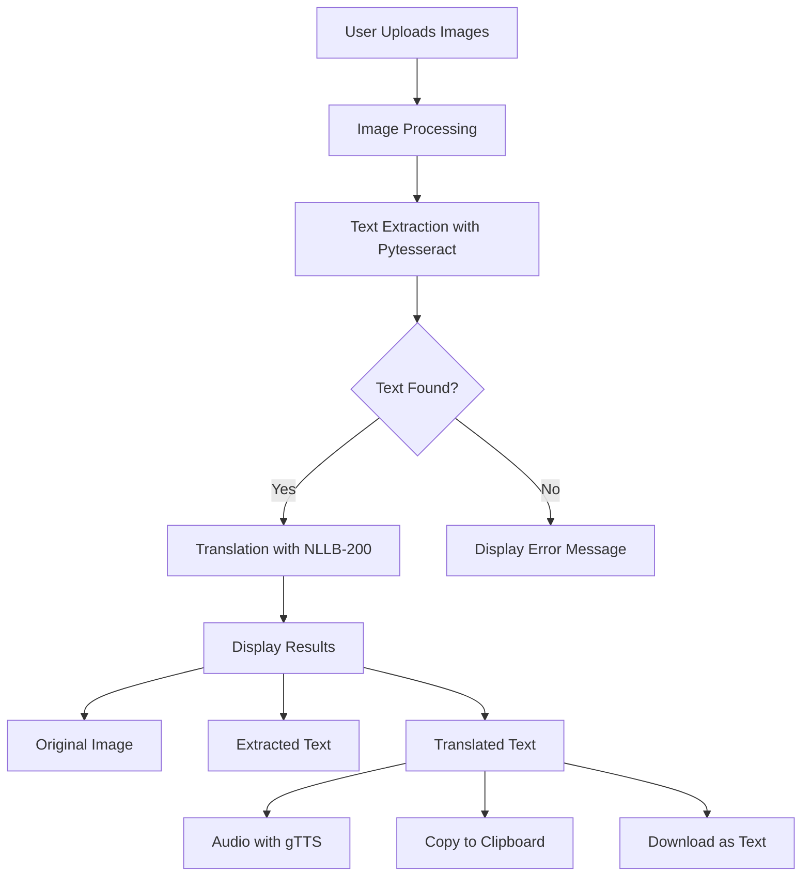

# English to Multiple Indian Languages Translator

A Streamlit application that extracts text from images and translates it into various Indian languages with audio support.


## Features

- 📸 Extract text from multiple images simultaneously
- 🔄 Translate extracted text to 7 Indian languages
- 🔊 Text-to-speech for translated content
- 📋 Copy translations to clipboard
- 💾 Download translations as text files
- 🖼️ Display of original images alongside translations
- 💻 User-friendly interface with responsive design

## Workflow

1. **Input**: User uploads one or more images containing English text
2. **Text Extraction**: Pytesseract OCR extracts text from the images
3. **Translation**: NLLB-200 model translates the text to the selected Indian language
4. **Results Display**: The app shows the original image, extracted text, and translation
5. **Additional Options**: Users can listen to audio pronunciation, copy to clipboard, or download translations

### Project Flow Diagram



## Tech Stack

- **Frontend & Application Framework**:
  - [Streamlit](https://streamlit.io/) - For the web application interface

- **Image Processing & OCR**:
  - [PIL (Pillow)](https://python-pillow.org/) - For image manipulation
  - [Pytesseract](https://github.com/madmaze/pytesseract) - For Optical Character Recognition

- **Translation & NLP**:
  - [Transformers](https://huggingface.co/transformers/) - For accessing pre-trained models
  - [NLLB-200](https://huggingface.co/facebook/nllb-200-distilled-600M) - Meta's No Language Left Behind model for translation

- **Text-to-Speech**:
  - [gTTS](https://gtts.readthedocs.io/) - Google Text-to-Speech API

- **Additional Libraries**:
  - [PyperClip](https://pypi.org/project/pyperclip/) - For clipboard functionality
  - [io](https://docs.python.org/3/library/io.html) - For handling byte streams

## Supported Languages

- Telugu (tel_Telu)
- Hindi (hin_Deva)
- Kannada (kan_Knda)
- Tamil (tam_Taml)
- Bengali (ben_Beng)
- Malayalam (mal_Mlym)
- Marathi (mar_Deva)

## Installation

1. Clone the repository:
   ```bash
   git clone https://github.com/VaishnaviVadla33/EnglishToTelugu.git
   cd EnglishToTelugu
   ```

2. Create a virtual environment:
   ```bash
   python -m venv venv
   source venv/bin/activate  # On Windows: venv\Scripts\activate
   ```

3. Install dependencies:
   ```bash
   pip install -r requirements.txt
   ```

4. Install Tesseract OCR:
   - **Windows**: Download and install from [here](https://github.com/UB-Mannheim/tesseract/wiki)
   - **macOS**: `brew install tesseract`
   - **Linux**: `sudo apt install tesseract-ocr`

## Requirements

Create a `requirements.txt` file with the following dependencies:

```
streamlit>=1.27.0
pillow
pytesseract
transformers
torch
sentencepiece
gtts
pyperclip
```

## Running the Application

Run the Streamlit app:
```bash
streamlit run app.py
```

The app will open in your default web browser, typically at `http://localhost:8501`.

## Usage Guide

1. Open the application in your web browser
2. Select your target Indian language from the sidebar
3. Upload one or more images containing English text using the file uploader
4. Wait for processing - the app will extract text and translate it
5. Review results:
   - View the original image
   - See the extracted English text
   - Read the translated text
6. Use available tools:
   - Listen to audio pronunciation of the translation
   - Copy the translation to clipboard
   - Download the translation as a text file
7. Use the "Reset All" button to start over with new images

## Limitations

- **Limited Data Processing**: Currently, the application is designed to work with a limited amount of input data. Very large images or a high number of concurrent uploads may affect performance.
- OCR accuracy depends on image quality, text clarity, and fonts
- Translation quality varies by language and content complexity
- Audio pronunciation may have limitations for certain complex terms
- Large image files may take longer to process
- The NLLB-200 model has token limitations which may affect translation of very long texts
- Memory usage can be high when processing multiple images simultaneously

## Contributing

Contributions are welcome! Please feel free to submit a Pull Request.

1. Fork the repository
2. Create your feature branch (`git checkout -b feature/amazing-feature`)
3. Commit your changes (`git commit -m 'Add some amazing feature'`)
4. Push to the branch (`git push origin feature/amazing-feature`)
5. Open a Pull Request

